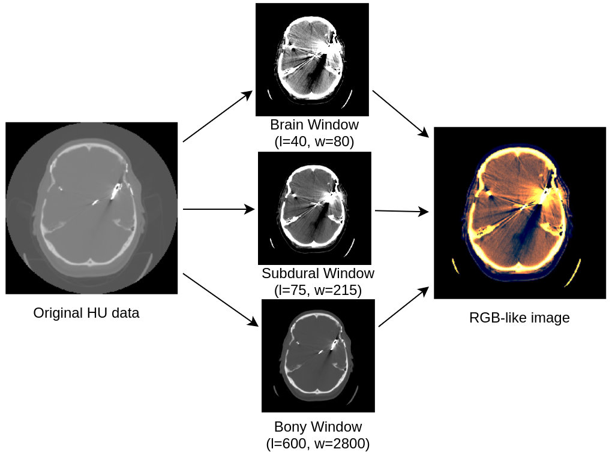
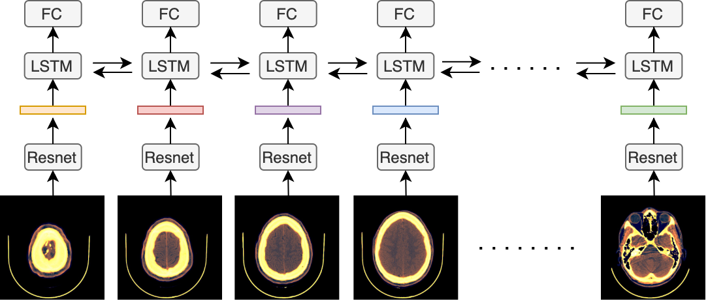

# midl2020-cnnlstm-ich
CNN-LSTM for intracranial hemorrhage detection

## Abstract 
We propose a novel method that combines a convolutional neural network (CNN) with a
long short-term memory (LSTM) mechanism for accurate prediction of intracranial hemorrhage on computed tomography (CT) scans. The CNN plays the role of a slice-wise feature
extractor while the LSTM is responsible for linking the features across slices. The whole
architecture is trained end-to-end with input being an RGB-like image formed by stacking
3 different viewing windows of a single slice. We validate the method on the recent RSNA
Intracranial Hemorrhage Detection challenge and on the CQ500 dataset. For the RSNA
challenge, our best single model achieves a weighted log loss of 0.0522 on the leaderboard,
which is comparable to the top 3% performances, almost all of which make use of ensemble learning. Importantly, our method generalizes very well: the model trained on the
RSNA dataset significantly outperforms the 2D model, which does not take into account
the relationship between slices, on CQ500. 

## Preprocess DICOM image

## Model

## Pretrained model weight

Trained weighted reported in the paper are available here:
www.kaggle.com/dattran2346/midl2020-cnn-lstm

| Models     | Weighted Log Loss |
|------------|-------------------|
| ResNet-50  | 0.05289           |

Table: Performance on the private test set of the RSNA ICH Detection challenge.
